# Hero's Userscripts 
Just some scripts I made to help make life easier on Neopets, hope you find some use too!  Always ensure that your use of userscripts complies with Neopets' rules. Happy to hear any suggestions or improvements for new or existing scripts! :)

# [Neopets Closet Enhancements](Neopets%20Closet%20Enhancements.user.js)
New Closet page! Added the Search Helper icons plus extra DTI icon, added top pagination, narrowed down popup click trigger, and removed category label.

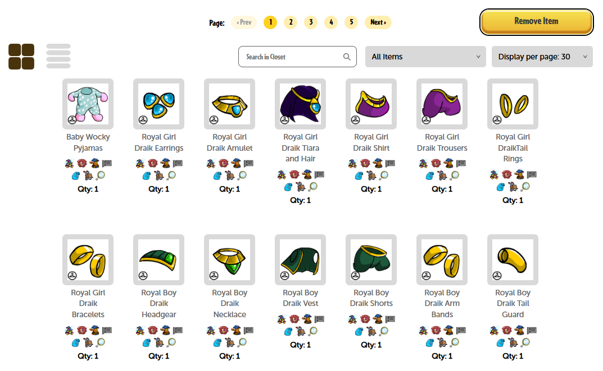

# [Neopets Quickstock Enhancements](Neopets%20Quickstock%20Enhancements.user.js)
Enhancing the new quickstock page with additional features like top pagination, search helper icons, item images, and compact view.

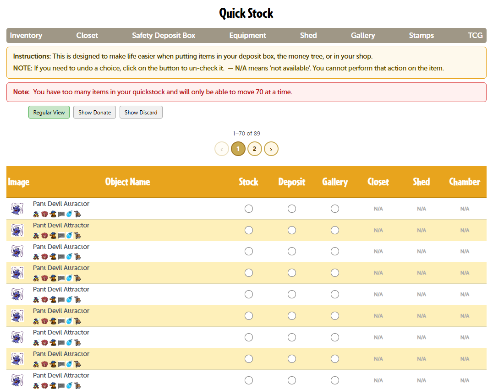

# [Neopets Game Trophies Tracker](Neopets%20Game%20Trophies%20Tracker.user.js)
Neopets game trophy tracker with modern UI, dynamic filtering, game links, and tracking list.

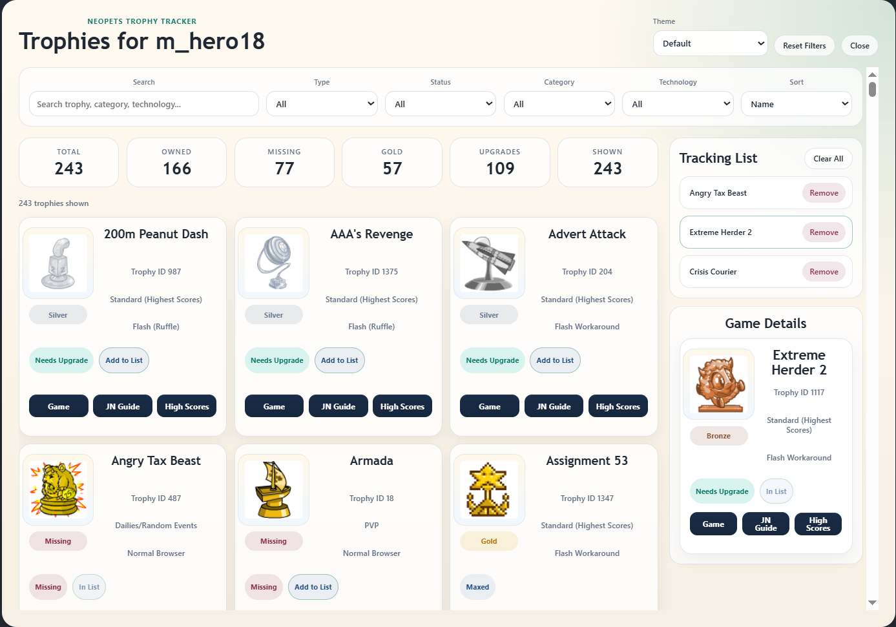

# [SDB Visualizer v2](SDB%20Visualizer%20v2.user.js)
Better SDB Viewer / Visualizer with modern UI, dynamic search, multiple filters, and metadata retrieved from itemDB. Includes prices, additional categories, wearable zoning, and more. 

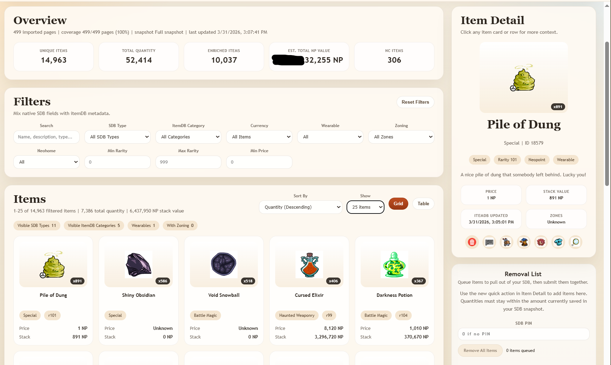

# [Neopets Trading Post Helper](Neopets%20Trading%20Post%20Helper.user.js)
Updated for new Trading Post. Added user action buttons under usernames (neomail, auctions, trades). And search helper icons under items (ssw, tp, auctions, sdb, jn, itemdb).

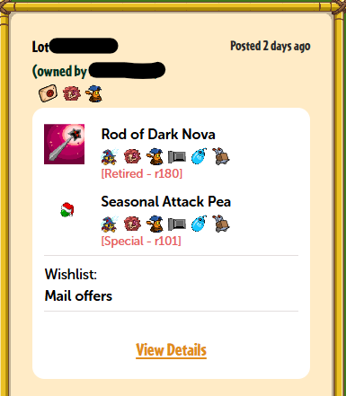

# [Neopets Petpet Lab Ray Grid Selector](Neopets%20Petpet%20Lab%20Ray%20Grid%20Selector.user.js)
Replace the dropdown with a better visual grid of petpets. 

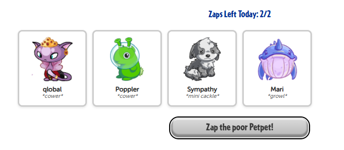

# [Jellyneo Add DTI and itemDB Links](Jellyneo%20Add%20DTI%20and%20ItemDB%20Links.user.js)
Adds an icon and link to DTI and itemDB in the sidebar on Jellyneo item pages. Only adds DTI if it's a wearable.

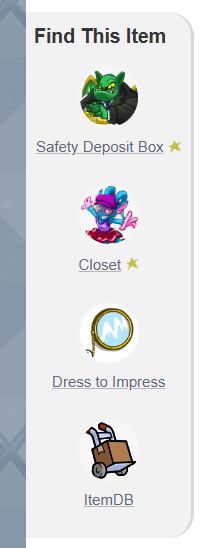

# [Neopets Sortable Shop Sales History Table](Neopets%20Sortable%20Shop%20Sales%20History%20Table.user.js)
Make Shop Sales History Table sortable by any column.

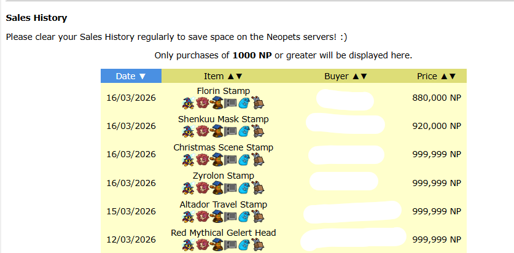

# [Neopets Edit Pet Description Better View](Neopets%20Edit%20Pet%20Description%20Better%20View.user.js)
Replace the pet carousel with a full grid and adds 'View Lookup' links.

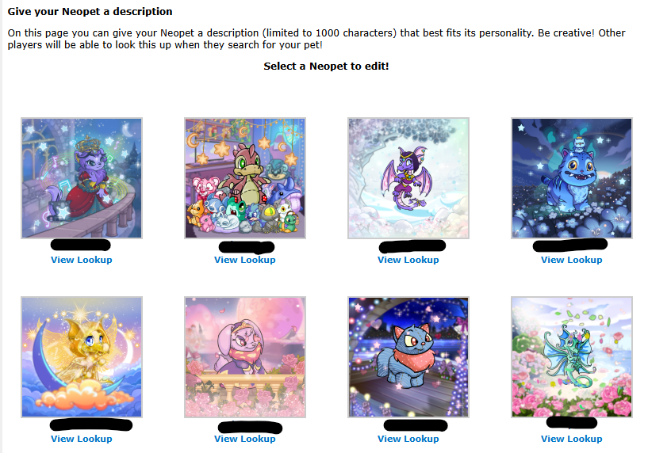

# [Kad Foods List Extractor](Kad%20Foods%20List%20Extractor.user.js)
Collects food items from the Kadoatery page and displays them in a copyable textbox. Useful for those are who are timekeeping.

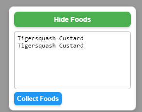

# [Neopets Alerts/Notifications Bubble Count Fix](Neopets%20Alerts%20Bubble%20Count%20Fix.user.js)
Fix the annoying Alerts/Notifications bubble count that is wrong. Makes it so that the correct count is displayed and nothing if there is none.

# [Neopets Training Schools Helper](Neopets%20Training%20Schools%20Helper.user.js)

Adds a helper table on training school status pages (Swashbuckling Academy, Mystery Island Training, Secret Ninja School). Helps make training multiple pets easier.
- Table showing all eligible pets, stats, and training status (Training, Need to Pay, Need to Complete)
 - Bulk select stats and train multiple pets at once
 - Buttons to: Train Selected, Complete Courses, Cancel Unpaid, Pay All Unpaid, Check All, Reset selected
 - Shows progress bar and feedback during actions
 - Displays stat increases after Completion

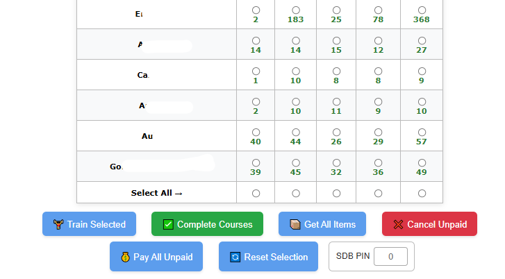
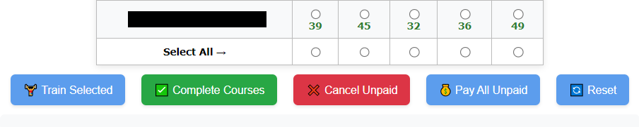

# [Neopets Neomail User Actions](Neopets%20Neomail%20User%20Actions.user.js)

Adds quick-access action buttons next to usernames in Neomail for Trading Post, Auctions, Shop, and Gallery. Works in both message list (inbox) and individual message view.

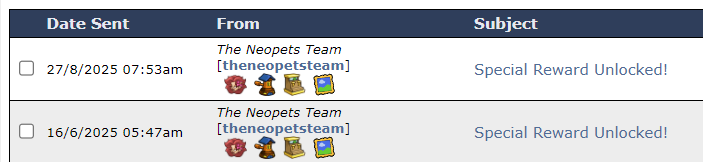
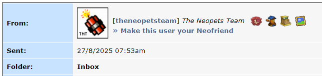

# [itemDB Lists Item Names Extractor](ItemDB%20List%20Item%20Names%20Extractor.user.js)

Extracts all item names from the List you are viewing on itemDB. Displays a floating, copyable text box in the bottom-right corner containing all item names.

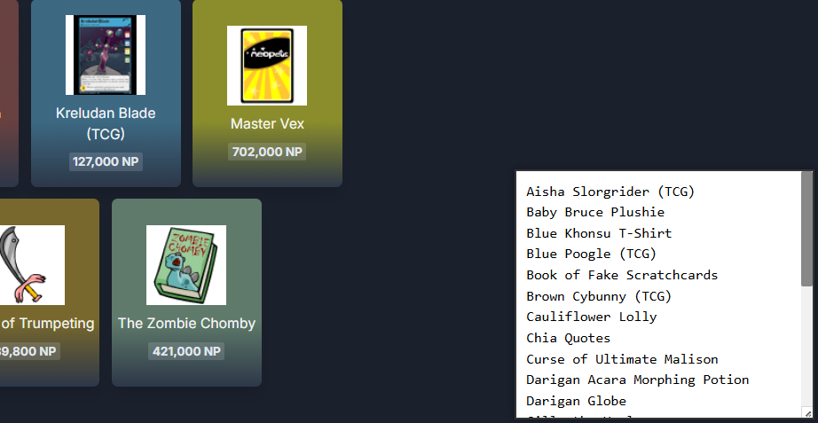

# [Jellyneo Item Names Extractor](Jellyneo%20Item%20Names%20Extractor.user.js)

Extracts all item names from Jellyneo item database page that you are on. Displays a floating, copyable text box in the bottom-right corner containing all item names.

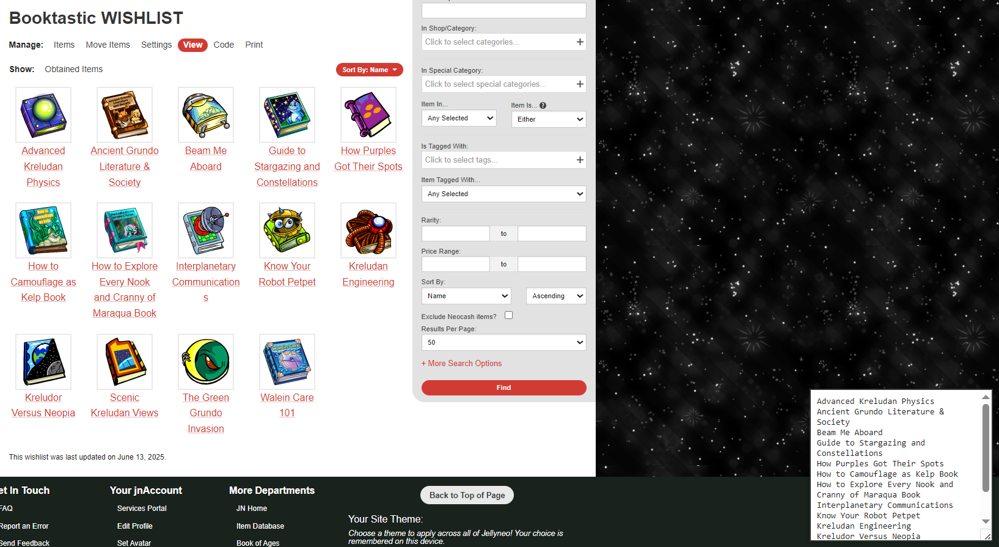

