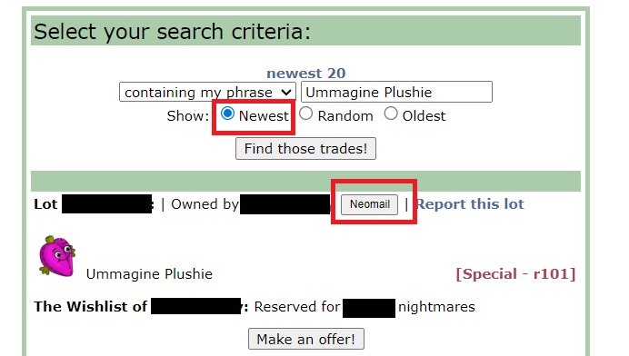
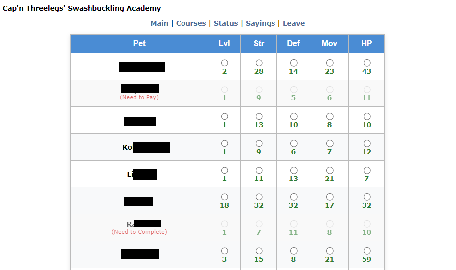

# Hero's Userscripts 
Just some scripts I made to help make life easier on Neopets, hope you find some use too!  Always ensure that your use of userscripts complies with Neopets' rules. Happy to hear any suggestions or improvements for new or existing scripts! :)

## [Neopets Trading Post Helper](Neopets%20Trading%20Post%20Helper.user.js)
Finds all username links and adds a "Neomail" button next to it that will open a new window with username pre-filled. It also automatically selects the "Newest" radio button.

## [Neopets Training Schools Helper](Neopets%20Training%20Schools%20Helper.user.js)

Adds a helper table on training school status pages (Swashbuckling Academy, Mystery Island Training, Secret Ninja School). Helps make training multiple pets easier.
- Table showing all eligible pets, stats, and training status (Training, Need to Pay, Need to Complete)
 - Bulk select stats and train multiple pets at once
 - Buttons to: Train Selected, Complete Courses, Cancel Unpaid, Pay All Unpaid, Check All, Reset selected
 - Shows progress bar and feedback during actions
 - Displays stat increases after Completion

## [Void BD Challenge Score Tracker](Void%20BD%20Challenge%20Score%20Tracker.js.user.js)

Calculates current BD Challenge score for The Void Within Battledome Challenge and displays on your record page.
Formula: total points = current score - starting score

## [Neopets Shops and Inventory Rarity Display](Neopets%20Shops%20and%20Inventory%20Rarity%20Display.user.js)

Collects item names and fetches rarity data from itemDB api. Adds color-coded rarity overlay on each item in your Inventory and in User Shops.

## [Neopets Item Price Values in Your Shop](Neopets%20Item%20Price%20Values%20in%20Your%20Shop.user.js)

## [Neopets Game Trophies Name Extractor](Neopets%20Game%20Trophies%20Name%20Extractor.user.js)

## [Jellyneo Item Names Extractor](Jellyneo%20Item%20Names%20Extractor.user.js)

Extracts all item names from Jellyneo item database page that you are on. Displays a floating, copyable text box in the bottom-right corner containing all item names.

